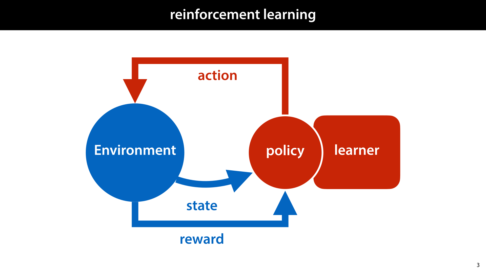
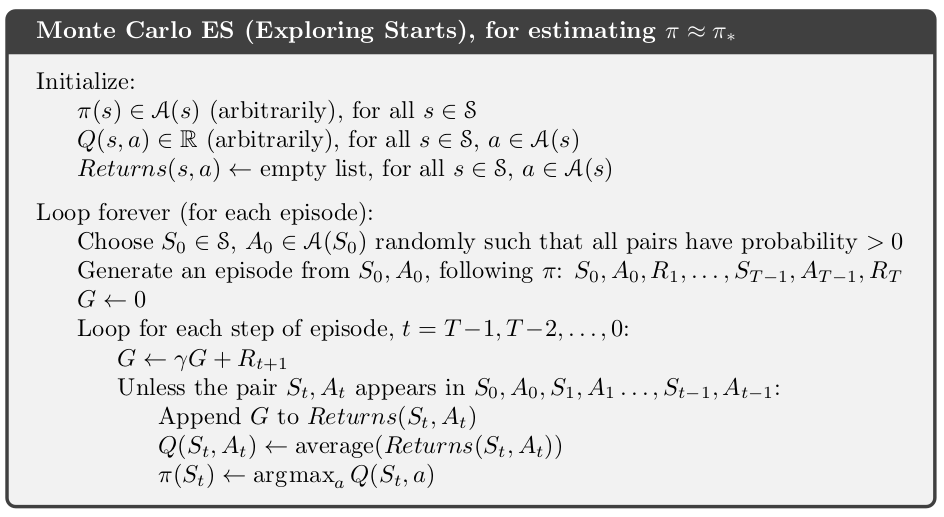
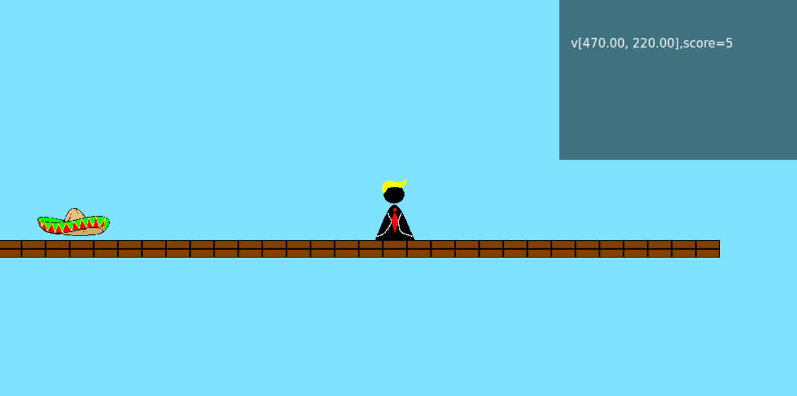

# Great Textbook

```
Reinforcement Learning: An Introduction
Richard S. Sutton
and Andrew G. Barto
```

Get it from: http://incompleteideas.net/book/the-book-2nd.html

# Reinforcement Learning



# Monte Carlo With Exploring Starts



# Tic-Tac-Toe

[tic tac toe](./docs/mc_tic_tac_toe.py)

# Platformer Game



# Quantization

The actual game has a continuous state. This state can be used to do physics. This "infinite" set of states can be quantized to a finite set of states.

This ensures that states that differ only slightly are not treated as completely different states.

# Game Generality

There is a set of basic ingredients which work for a variety of actual games. The goals of the actual game can be chosen flexibly, for instance: collecting the most points, killing the opponent, etc ...

A single-screen platformer. There is a player, an npc and a map made of tiles. The npc has identical capabilities to the player. There are plaforms on which the player/npc can jump. There are collectible tokens (points) that increase the score. Hitting the npc/player decreases their health.

# TODO

- GUI
- record an episode from actual user gameplay
- is colliding and jumps

# BUGS

- Sometimes order of application of rules matters.
- With certain initial velocities x may end up exactly superimposed over y (without ever touching it as it should). So at the moment of collision you end up with vector (0,0) as your collision normal, which means separation velocity = zero.
- pre-render un-movable objects on another canvas https://developer.mozilla.org/en-US/docs/Web/API/Canvas_API/Tutorial/Optimizing_canvas
